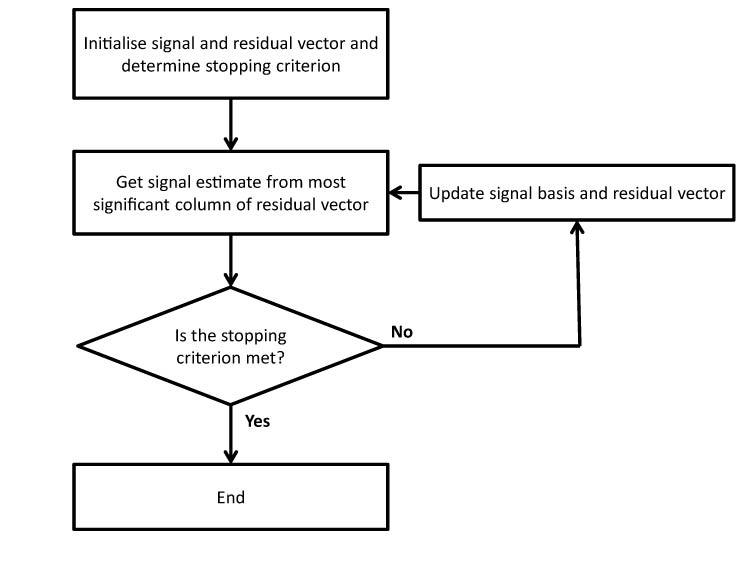
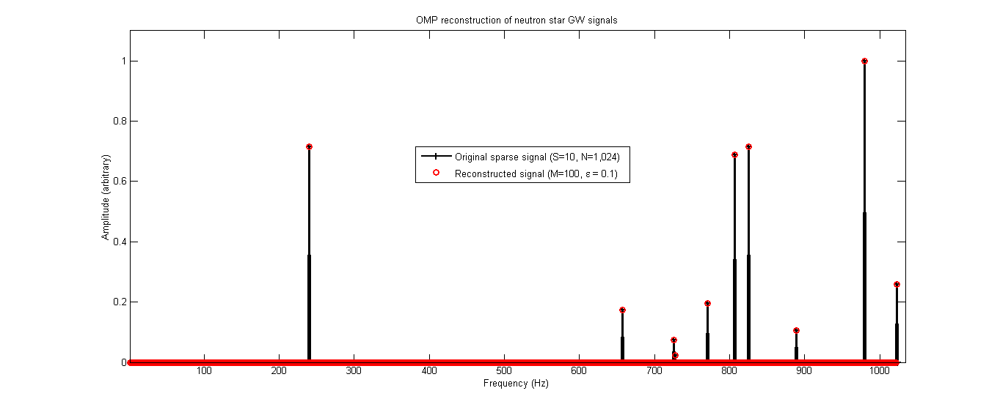
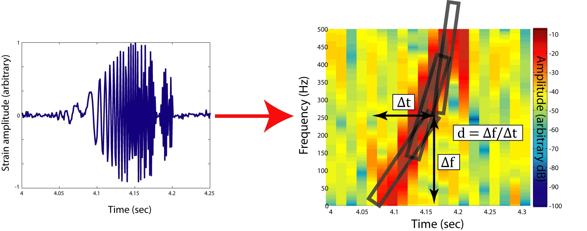

# SparseGravitationalWaves
Sparse methods (and compressed sensing) applied to gravitational wave signal processing 

Gravitational wave signals are expected be sparse in four main
sensing bases, according to the source: transient ('burst')
sources are expected to appear as isolated pulses in the time
domain, quasi-monochromatic ('continuous') signals appear as a
small number of frequencies in the Fourier domain. The early
(stationary phase) inspiral portion of an unstable close compact
binary system is expected to produce a sparse signal in the
time-frequency ('chirp') plane (which we've already seen!). Finally the so-called 'stochastic
background' is sparse in an inter-detector cross-correlation space in the Fourier domain.

Recently a powerful mathematical framework has been developed, allowing _e.g._ accurate
reconstruction of signals sampled at rates well below that determined by the
Shannon-Nyquist limit, as long as the signal is known to be sparse in some representation.

Here I show how to apply these sparse methods to gravitational wave data analysis. In some cases, they may
improve computational efficiency enough to make a number of continuous wave searches viable that are currently computationally prohibited. 

Another application may help improve position resolution of certain burst gravitational wave sources detected by gravitational wave networks.

Note that the run-time for the code I've implemented here (a basic Orthogonal Matching Pursuit (OMP) algorithm with a noise-based stopping criterion) 
is relatively poor. A hardware acceleration method,
such as a GPU, or preferably an FPGA, would speed up processing of this particular implementation by a factor of almost 3,000.

### Background: from Syphilis to Cylons

The concept of exploiting the sparse nature of data was made famous during World War II to minimise testing of drafted soldiers for 
syphilis, using so-called 'group testing' methods [Dorfman, R.: "The detection of defective members of large populations," _The Annals of Mathematical Statistics_ **14**(4):436-440 (1943)].


A commonly used algorithm in radio interferometry, CLEAN, relies on similar assumptions, allowing a great deal of undersampling. It has even been suggested
that a decent application of group testing would have significantly altered the plot in the rebooted sci-fi TV series 'Battlestar Galactica' [Bilder, C.R.: "Human or Cylon? Group testing on 'Battlestar Galactica'," _Chance_ **22**(3):46-50 (2009)].

From the mid-2000s, a powerful new mathematical framework was developed, which could determine the level of undersampling while still ensuring accurate reconstruction of a broad class of sparse signals.

This so-called 'compressive sampling' (CS; also known as 'compressed sensing'; see _e.g._
[Cand\`{e}s, E., Romberg, J. and Tao, T.: "Robust uncertainty principles: Exact signal reconstruction from highly incomplete frequency information," _IEEE Trans. Information Theory_  **52**(2):489-509 (2006), Donoho, D.L.:"Compressed sensing," _IEEE Trans. on Information Theory_ **52**(4):1289-1306 (2006), MacKenzie, D.: "Compressed sensing makes every pixel count," _American Math. Soc._  **7**:114-127 (2009), Baraniuk, R.G.: "More Is Less: Signal Processing and the Data Deluge," _Science_ **331**:717 (2011)] technique has been applied to optical sensing (notably a one pixel
camera, medical imaging and astronomy. 

### How OMP works

Orthogonal Matching Pursuit (OMP) is an iterative algorithm that takes the initial data, and identifies the most significant coefficient (as defined by some inner product).
It removes this coefficient and re-calculates the remaining ('residual') data, to generate an underlying basis, obtaining the next most significant coefficient, _etc._:



This process is halted when the _stopping criterion_ is met. Often we are looking for the _N_ most significant coefficients in the data. In this case, we halt the procedure after _N_
loops. However, in the case of real-world signals, we don't often get a nice clean signal and have noise to contend with. The beauty of OMP is that we can define a noise threshold, &epsilon;, as a stopping criterion.
This is a Euclidean bound on the total noise of the system.


### OMP in action 

Let's see what the main functions, [OMP.m](OMP.m) and [GenSparseVectors.m](GenSparseVectors.m), do:

```
>> help OMP
   [x, R] = OMP(phi, y, epsilon)
 
  Orthogonal Matching Pursuit recursive reconstruction algorithm
  for compressive sampling.
 
  This solves the inverse problem y = phi*x, by finding x (N X 1 vector),
  where A = M X N measurement matrix, y = M X 1 measurement vector.
  epsilon is a scalar representing the stochastic/residual noise.
  This can be used to define a confidence limit to the Chi-squared distribution.
 
  Very similar to CLEAN routine used in radio interferometry; 
  the stopping criterion is when the residual vector R is reduced below the 
  threshold, epsilon
 

>> help GenSparseVectors
  GenSparseVectors.m
  [phi, y, s] = GenSparseVectors(M, N, S)
 
  For testing of sparse algorithms.
  This function produces S non-zero coefficients in an N dimensional
  coefficient space from M measurements. 
  Function output is an N-length vector s, with S randomly assigned
  non-zero entries. It also produces a random sensing matrix phi,
  which is created from M measurements of phi*s.
```

Let's generate a measurement vector, y, with 10 measurements, that was the result of a measurement system characterized by a random 10x1024 measurement matrix, phi, from an underlying sparse vector, s, with up to 10 non-zero coefficients:

```
>> [phi, y, s] = GenSparseVectors(10, 1024, 10);
>> plot(1:length(y),y)
>> plot(1:length(s),s)
```

Check the mutual coherence, &mu; , which we want to be minimal between the measurement and the sparsity basis:

```
>> mumu(phi)

ans =

  0.013
```


Use OMP to obtain an estimate, x, of the initial vector:

```
>> x = OMP(phi, y);
>> Warning: setting residual error to default [1E-5]
>> length(x)

ans =

   754

>> length(s)

ans =

        1024


```

Note that this version of OMP terminates when it meets the noise conditions imposed upon it, so the length of x here is 754, less than the full vector of coefficients (1024).

The reconstruction fits the original signal exactly:



Yet, we used only 100 measurements--less than 10% of the coefficients--to do so! 

In other words, we only took 10% of the measurements required from conventional sampling theory. 


Let's look at generating a sparse system, with its own measurement matrix, using `GenSparseVectors`:

```
>> help GenSparseVectors
  GenSparseVectors.m
  [phi, y, s] = GenSparseVectors(M, N, S)
 
  For testing of sparse algorithms.
  This function produces S non-zero coefficients in an N dimensional
  coefficient space from M measurements. 
  Function output is an N-length vector s, with S randomly assigned
  non-zero entries. It also produces a random sensing matrix phi,
  which is created from M measurements of phi*s.

>> [phi, y, s] = GenSparseVectors(10, 1024, 10);
>> x=OMP(phi, y, 1e-6);
>> size(phi)

ans =

         100        1024

>> size(y)

ans =

   100     4

>> size(s)

ans =

        1024           4

>> figure(2)
>> plot(1:length(s),s,'-ko',1:length(x),x,'-rx')
```

### Application of OMP to gravitational-wave inspiral signals

The main use-case that justified the fairly large investment into the LIGO and Virgo gravitational wave projects was for the observation of the inspiral events associated with two closely orbiting compact objects (black holes and/or neutron stars) coalescing together, emitting progressively higher amplitude, and frequency, gravitational waves. 

As mentioned briefly in the introduction, we expect this signal to come as a _chirp_; that is, the frequency of the signal increases as a simple function of time. If we were to construct an efficient template bank to detect this signal with a low latency, we might parameterize this chirp with four parameters: the time of the peak amplitude, _t0_, the associated frequency, _f0_, the slope _d_ and the Q-factor, _Q_: 





### Working with a 4-dimensional wavelet ('Chirplet') bank

Code, similar to that used above, but designed for a 4-dimensional wavelet bank of chirped wave-forms (a 'chirplet') can be run similarly to the above code. The syntax of the functions is the same, except the names are appended with a '4' suffix.

Let's have a look at the chirplets themselves:

```
>> t=0:0.0001:10;
>> y1 =chirpxform(t, f0(1), tau0(1), Q0(1), d0(1));
>> y = zeros(size(t));
    for i = 1:S;
        y = y + chirpxform(t, f0(i), tau0(i), Q0(i), d0(i));
    end
>> plot(t,real(y1))
>> fs=1/(t(2)-t(1))

fs =

       10000

>> specgram(y1,2^4,fs)
>> plot(t,real(y))
>> specgram(y,2^4,fs)
>> xlabel('Time (sec)')
>> ylabel('Amplitude (arbitrary)')
>> title('Chirplet: single injection')
>> gtext({'f_0 = 335 Hz' , '\tau_0 = 3.36 s' , 'Q_0 = 869' , 'd_0 = -2,617 Hz/s'})
```

```
>> help GenSparseVectors4
  GenSparseVectors4.m
  [phi, y, s] = GenSparseVectors4(M, N, S)
 
  For testing of sparse algorithms.
  This function produces S non-zero coefficients in an N dimensional
  coefficient space from M measurements in 4 dimensions.
 
  Function output is an N X 4 matrix s, with S randomly assigned
  non-zero entries. It also produces a random sensing array, phi,
  which is created from M measurements of phi*s.
 
>> plot(1:length(s1),s1,'-ko',1:length(x1),x1,'kx',1:length(s2),s2,'-ro',1:length(x2),x2,'rx',1:length(s3),s3,'-bo',1:length(x3),x3,'bx',1:length(s4),s4,'-go',1:length(x4),x4,'gx')
>> legend('f_0 (inj.)','  (recon.)','\tau','','Q','','d_0','')
>> axis('tight')
>> axis([0 1024 -2.7 1.7])
>> xlabel('Coefficients')
>> ylabel('Amplitude (arbitrary)')
>> title('Four dimensional OMP reconstruction (M_i=100, N_i=1024, S_i=10)')
```
